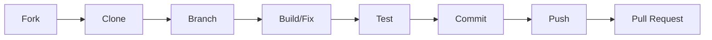

# 🗺️ AlgoScope - Contribution Roadmap

Welcome to the **AlgoScope** contributor community! This roadmap is designed to help you navigate your journey from a first-time cloner to an advanced open-source contributor.

---

## 🏗️ Project Overview
- **Type:** Open Source DSA Visualizer
- **Focus:** Frontend Development, DSA Visualization, High-Fidelity Animations, Interactive Learning

---

## 🚀 Recommended Contribution Path

### Phase 1: Project Understanding (The Foundation)
Master the basics of the project architecture and environment.

**Tasks:**
- [ ] Clone the repository
- [ ] Install dependencies
- [ ] Run the project locally
- [ ] Understand the folder structure
- [ ] Explore all existing visualizers

**Quick Start Commands:**
```bash
git clone https://github.com/algoscope-hq/AlgoScope.git
cd AlgoScope
npm install
npm run dev
```

**Key Areas to Explore:**
- `src/components/sortingAlgo` - Sorting animation logic
- `src/components/searchAlgo` - Graph & Search visualizations
- `src/components/visualizer` - Shared playback & controls
- `src/algorithms` - Core logic step generators

---

### Phase 2: Beginner Contributions (Skill Building)
**Difficulty:** 🟢 Easy
Focus on refining the existing experience and fixing low-hanging fruit.

- 📱 **Responsive Design:** Fix layout issues on small screens.
- ✨ **Micro-interactions:** Improve button hover/active states.
- ⏳ **Loading States:** Add smooth transitions for data fetching or generation.
- 🎞️ **Smooth Animations:** Refine Framer Motion/Anime.js timing.
- ♿ **Accessibility:** Audit and fix ARIA labels and keyboard navigation.
- 🎮 **Playback Controls:** Improve the UX of speed and pause/play sliders.

---

### Phase 3: Strong Portfolio Contributions (Impactful Features)
**Difficulty:** 🟡 Medium
Build standalone visualizers that demonstrate deep DSA and Frontend knowledge.

| Project | Priority | Benefits |
| :--- | :---: | :--- |
| **Sliding Window Visualizer** | 🔥 High | Shows DSA logic + animation sync. Perfect for LinkedIn. |
| **Trie Visualizer** | 🔥 High | Demonstrates mastery of complex tree structures. |
| **Linked List Visualizer** | ⚡ Medium | Beginner-friendly, highly visual, and educational. |

---

### Phase 4: Advanced Contributions (The Innovation)
**Difficulty:** 🔴 Advanced
Implement cutting-edge features that push the boundaries of educational tools.

- 🤖 **AI-Generated Explanations:** Integrate LLMs for real-time logic walkthroughs.
- 🎙️ **Voice Narration:** Add audio guidance for step-by-step execution.
- 💡 **Educational Overlays:** Context-aware hints for complex steps.
- 📊 **Complexity Visualizer:** Real-time Big O notation tracking.
- 🎓 **Interview Prep Mode:** Time-limited challenges and quizzes.
- ⏪ **Reverse Playback:** Full state-history tracking for backwards execution.

---

## 🏆 Best First Contribution: **Sliding Window Visualizer**
**Why this?**
- Perfect match for Frontend + DSA skills.
- High impact: One of the most requested visual tools for interview prep.
- Extremely easy to showcase on your portfolio and social media.

---

## 🔄 The Contribution Workflow



1. **Fork** the repository.
2. **Clone** your fork locally.
3. **Create** a new branch: `git checkout -b feature/your-feature-name`.
4. **Build** your feature or fix the bug.
5. **Test** properly (build check, linting, manual verification).
6. **Commit** changes with meaningful messages.
7. **Push** your branch: `git push origin feature/your-feature-name`.
8. **Create** a Pull Request on the main repository.

---

## 💡 Important Skills You Will Gain
- **React Architecture** & State Management
- **Advanced Animation Systems** (Framer Motion, Anime.js)
- **Algorithm Visualization** logic
- **Open Source Collaboration** & Professional Git Workflow
- **Frontend Optimization** for high-performance rendering

---

## ⚠️ Guidelines & Best Practices

### 🚫 Avoid
- Large, unplanned PRs without prior discussion.
- Copy-pasting code from other visualizers without understanding.
- Unoptimized or "jittery" animations.
- Hardcoded values and non-responsive UI.

### ✅ Maintainer Tips (How to get your PR merged faster!)
- **Clean Commits:** Use clear, atomic commits.
- **Rich Descriptions:** Explain *why* and *how* in your PR.
- **Visual Proof:** Always include **Before/After screenshots** or GIFs.
- **Modularity:** Keep components small and reusable.
- **Documentation:** Update relevant `.md` files for your new feature.

---
*Made with ❤️ by the AlgoScope Community*
